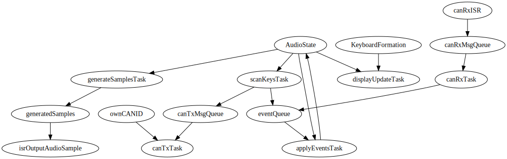

# Synthesizer Project Report

## Implemented Features

- All features specified in [Lab Part 1](doc/LabPart1.md) and [Lab Part 2](doc/LabPart2.md).
- Additional features:
    - Smooth knob decoding on V1 hardware.
    - Polyphony with many simultaneous notes.
    - Four waveforms (sawtooth, triangle, sine, square) selectable at run-time using a knob.
    - A graphical UI showing the octave number of each keyboard, a volume bar, and a graphical waveform icon.
    - A custom handshaking protocol with support for (in theory) almost infinitely many keyboards in series, limited by internal data type widths, audio sample rate, and human hearing frequency limits.
    - Synchronisation of volume and waveform settings across connected keyboards.
    - Simultaneous audio output from all connected keyboards.

## List of Software Tasks

All of the following OS tasks and interrupts are implemented in [src/main.cpp](src/main.cpp).

| C++ Function Name      | Task Description                                             | Type      |
| ---------------------- | ------------------------------------------------------------ | --------- |
| `scanKeysTask`         | Key scanning                                                 | OS Thread |
| `displayUpdateTask`    | Drawing UI and communication with OLED controller            | OS Thread |
| `applyEventsTask`      | Applying key events and settings updates                     | OS Thread |
| `generateSamplesTask`  | Generating audio samples                                     | OS Thread |
| `canTxTask`            | Transmitting queued outgoing CAN messages                    | OS Thread |
| `canRxTask`            | Decoding and queuing events for incoming CAN messages        | OS Thread |
| `canRxISR`             | Moving received CAN messages from hardware buffer to software buffer | Interrupt |
| `isrOutputAudioSample` | Writing audio output samples                                 | Interrupt |

## Shared Data Structures

| Data Structure                          | Written To By                        | Read From By                                                 | Protection                                                   |
| --------------------------------------- | ------------------------------------ | ------------------------------------------------------------ | ------------------------------------------------------------ |
| `uint32_t ownCANID`                     | - Handshaking code (single-threaded) | - Handshaking code (single-threaded) - `canTxTask`      | None needed: is read-only after handshaking                  |
| `StreamBufferHandle_t generatedSamples` | - `generateSamplesTask`              | - `isrOutputAudioSample`                                     | Built-in to the OS as long as there is only one writer and one reader. |
| `struct KeyboardFormation`              | - Handshaking code (single-threaded) | - `displayUpdateTask` - `scanKeysTask`                  | None needed: is read-only after handshaking                  |
| `struct AudioState`                     | - `applyEventsTask`                  | - `scanKeysTask` - `applyEventsTask` - `displayUpdateTask` - `generateSamplesTask` | A mutex protects the whole struct. To reduce waiting time, some reading threads make a local copy of the struct and release the mutex before using the data. |
| `QueueHandle_t eventQueue`              | - `canRxTask` - `scanKeysTask`  | - `applyEventsTask`                                          | Built-in to the OS                                           |
| `MessageBufferHandle_t canRxMsgQueue`   | - `canRxISR`                         | - `canRxTask`                                                | Built-in to the OS as long as there is only one writer and one reader |
| `MessageBufferHandle_t canTxMsgQueue`   | - `scanKeysTask`                     | - `canTxTask`                                                | Built-in to the OS as long as there is only one writer and one reader |

## Possibility of Deadlock

There is one potential data loop involving `AudioState`, `scanKeysTask`, `eventQueue`, and `applyEventsTask`. However, as all members of `AudioState` are (or wrap) primitive types, writes are inherently atomic and `scanKeysTask` reads it without claiming the mutex. 
